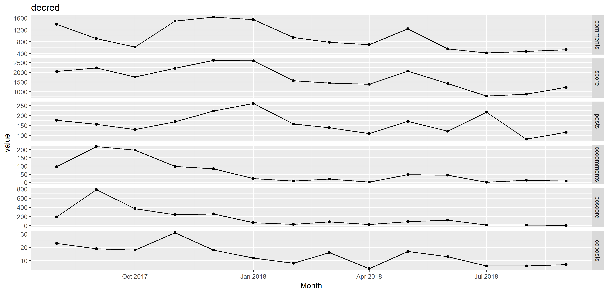
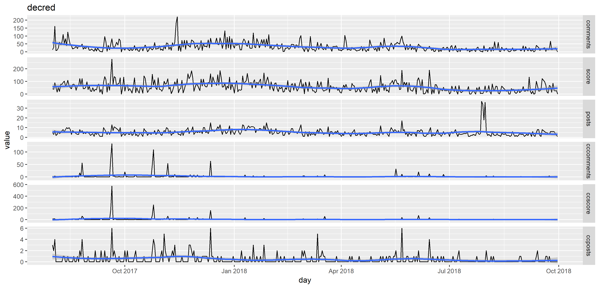
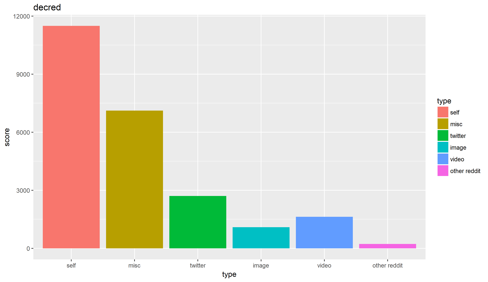
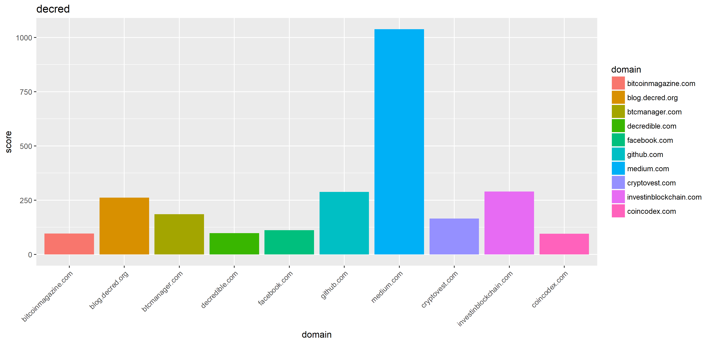
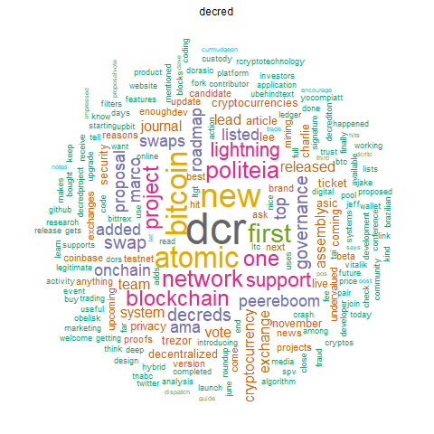
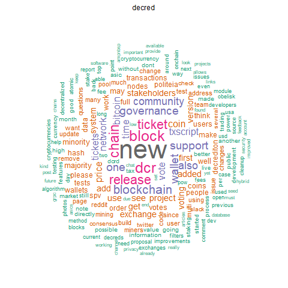
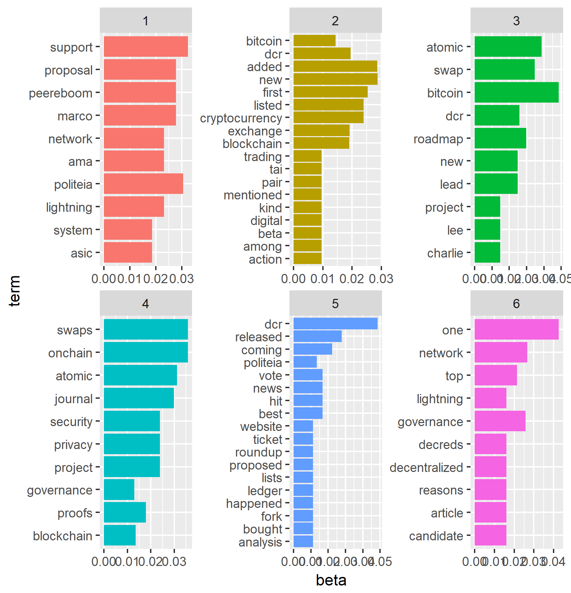
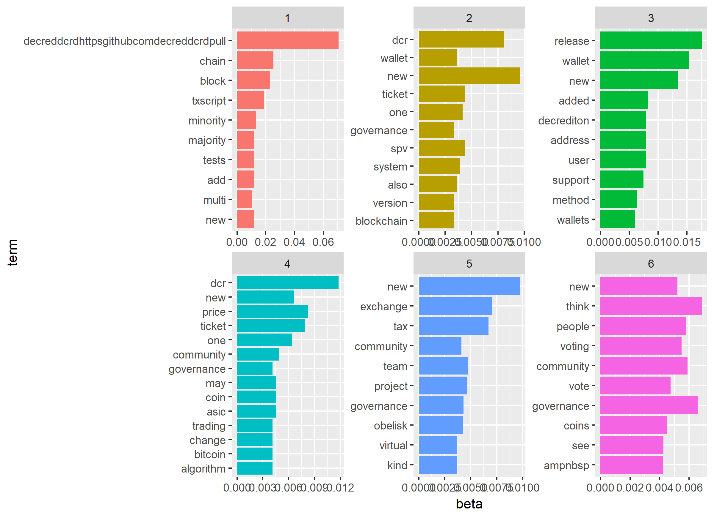

# Subreddit analysis

This folder contains code to run a variety of analyses and visualizations on data from a selection of reddit cryptocurrency-related subreddits. They are fairly crude and a work in progress, but do give some insight into dynamics of the last year or so on crypto-reddit. 

It is also a test for how well sharing a large volume of files and images through GitHub works. The analyses shown below for Decred have been run for all of the other top 30 or so cryptocurrencies on coinmarketcap. I have included images for these, and subreddit-specific data-sets, in the data folder.

I have used the data in this [bigquery table](https://bigquery.cloud.google.com/dataset/fh-bigquery:reddit_posts)  for analysis. It appears to be a comprehensive set of reddit posts.

I'm dumping the code here in its very rough current form, if anyone wants to run or amend any of it I could tidy it up a bit. I'm opening this up to see if anyone is interested in it.

### Activity levels by month

Comments, Score and Posts are the numbers from the subreddit for the month. cccomments, ccscore and ccposts relate to posts with the cryptocurrency's name in their title from /r/cryptocurrency

The code for matching posts from cryptocurrency is very basic, I set a name and ticker symbol for each subreddit and then looked for posts whose title contained one of these strings.

### Activity levels by day

Like activity levels by month, but noisier. 

### Type of posts

This bar chart shows activity on the subreddit in terms of score, because generally posts with a higher score will be seen and discussed more by users of the subreddit than posts with low scores. The types defined here are the easiest ones to identify from the domain of the posts. Misc covers any posts with a domain that doesn't match one of the other types. There are quite a lot of discussion posts and miscellaneous posts for Decred.

### Domains

This covers the top 10 domains which weren't covered by the categories above. Posts linking to Medium tend to get a lot of upvotes, github and blog.decred.org are up there too.

### Wordclouds

^ A wordcloud drawn using the words from the titles of all submitted posts.

A wordcloud drawn using the self text of self posts that were in the top 10% high scoring posts for the subreddit that month.

For the wordclouds above and latent dirichlet allocation analyses below some standard text processing steps have been ham-fistedly applied.

Latent Dirichlet Allocation is a topic modelling method, it identifies topics based on co-occurrence of words within documents (post titles above, self text below) and assigns each document probabilistically to the topics. These images show the top 10 terms associated with each of six topics. 

All of the analyses presented in these images are rough, repeated with the same settings for every subreddit without care and consideration. There is ample room for all of them to be improved, if that's worth the effort. There are also many analyses that could be run with the comments data.