# Reddit CryptoCurrency observations - Part 1

This post is probably going to be part of a series where I play around with reddit data to provide an overview of activity and see if it's possible to answer any interesting questions.

Subreddits like /r/bitcoin and /r/cryptocurrency have a certain character to them,  casual observation and discussion suggests that there are various forms of "manipulation" at play. That would hardly be surprising, as the attention which high-scoring posts on these subreddits command can help a new project to be discovered and popularised. 

During the alt-coin madness of December 2017 and January 2018, I have little doubt that /r/cryptocurrency in particular was influencing prices to at least some degree.  Even the perception that this was the case would make reddit a useful and attractive tool for anyone who could use it. Reddit has never seemed particularly robust to manipulation, by sock-puppet accounts (there's a [marketplace for established accounts](https://www.playerup.com/accounts/redditaccount/)) or brigading, so it would not be surprising if some parties were manipulating the crypto subreddits successfully. 

In fact there have already been several documented cases of manipulation. [VeChain posts were banned from /r/cryptocurrency](https://www.reddit.com/r/Vechain/comments/7vtipm/regarding_this_rcryptocurrency_ban_this_is_the/) for coordinating upvoting through their official Telegram group. There have been stories of censorship on /r/bitcoin [for years](https://medium.com/@johnblocke/a-brief-and-incomplete-history-of-censorship-in-r-bitcoin-c85a290fe43), and people are still telling fresh stories of why they are being banned. 

I doubt there's any direct evidence of manipulation in the available public data, or at least that's not really what I'm looking for. The plan is to first build up a picture of how these subreddits work and how they've been changing over time, then see where it goes.

I have used the data in this comprehensive looking [bigquery table](https://bigquery.cloud.google.com/dataset/fh-bigquery:reddit_posts) as a starting point for analysis. It appears to be a comprehensive set of reddit posts, but I'm not sure yet whether it includes deleted/censored posts, my guess is not. 

I have provided the post data for /r/cryptocurrency from August 2017-May 2018 in [two](reddit1/data/cc-export1.csv) [files](reddit1/data/cc-export2.csv), along with the [R code](reddit/reddit1/reddit-1.R) to run the analyses and some tables that are generated along the way.

## /r/Cryptocurrency

#### Observation period: August 2017 - May 2018

In this time period /r/cryptocurrency saw a total of 281,770 post submissions; these posts were commented on 2.84 million times and had a combined score (upvotes less downvotes) of 7.1 million. Unfortunately reddit doesn't return upvotes and downvotes through the API so there's no way to look at how controversial posts were.

Reddit focuses user attention on posts that score well, and the distribution of score between posts is highly skewed. 

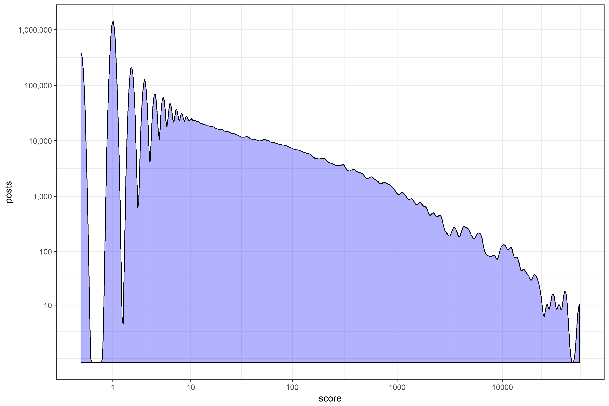

Posts that appear near the top of a subreddit's Hot ranking (which penalises older posts) are most visible and consequently most voted on. Posts which are appreciated by the subreddit's voting users on the main page they will tend to stay there for hours and amass a lot of upvotes and comments.

There were 9,391 posts that had a final observed score 100 or more, these were the top scoring 3% of posts submitted. Together, these posts received 81% of all score and 53% of all comments, or 1.5 million comments.

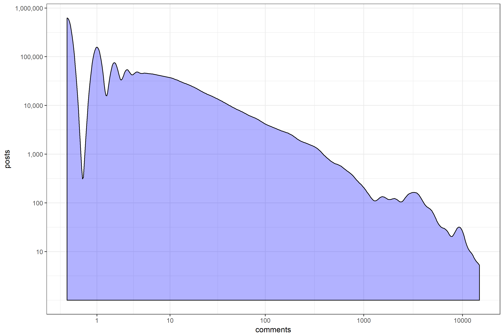

Comments are an indirect indicator of visibility. Posts that score well will tend to have many comments, although different types of post attract comments at different rates.

### Activity levels through time

#### Posts/Score/Comments per day of observation period

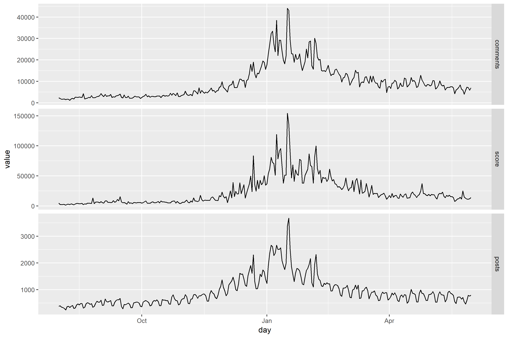

Activity data per day of post submission [here](reddit/reddit1/data/days.csv).

That looks familiar. Not a huge surprise that /r/cryptocurrency saw a big increase in activity levels around the bull market of late 2017 early 2018.

Activity by day of the week

##### Activity by day of the week

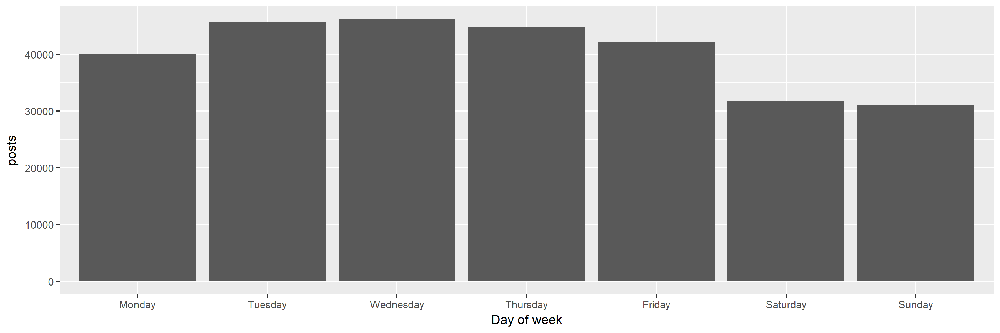

I'm interested in whether there are hour of the day effects too, the following bar chart suggests that there are.

##### Post submissions and success by [hour](reddit/reddit1/data/hours.csv) of the day

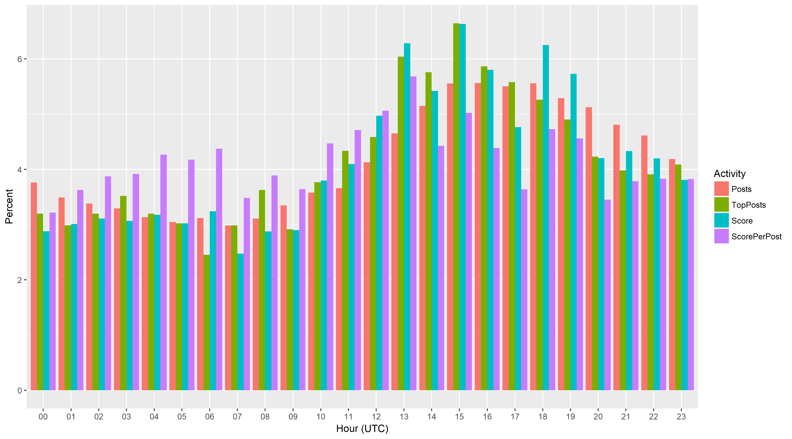

This bar chart shows:

- Percentage of Post submissions per hour
- Percentage of Top 1% Post submissions per hour
- Percentage of total Score accruing to posts submitted per hour
- Score per Post for the hour, represented as a percentage of the total score per post

The graph suggests there are some submission times when posts tend to do a little better/worse. Around 1300 looks good, with 4.6% of posts submitted in this hour but 6% of the top posts submitted in this hour. Around 2000 looks like a bad time, with 5.1% of posts submitted but only 4.2% of top posts.

### What kind of content is popular on /r/cryptocurrency?

[Domains](reddit/reddit1/data/domains.csv) are a decent starting point for considering the type of content submitted and discussed. I created a table with the number of posts per domain and their summed comments and scores[link]. 

The number of posts associated with a domain tells us how often people submitted posts which linked to it, while the score and comments for these posts give an indication of how successful they were at capturing the attention of /r/cryptocurrency subscribers.

Looking at it from a domains perspective, and sorting the list by number of comments and score, the dominant types of content are as follows:

1. **Self posts** (self.cryptocurrency) - These are text posts created directly by the submitting user, and they account for **45% of all post submissions, 61% of all comments, and 26% of all score**. There are a lot of comments associated with daily discussion posts submitted and stickied by the automoderator daily, 618k comments or 22% of all the comments on the subreddit.
2. **Images** - Links to reddit's own image hosting service (i.redd.it) and other image hosting sites (e.g. imgur.com, gfycat.com). Image posts account for **9% of all post submissions, 13% of all comments, and 29% of all score**.
3. **Videos** - Links to reddit's own video hosting service and youtube. **4.5% of posts, 2.2% of comments and 3.6% of score.**
4. **Twitter** - Links to twitter, mostly to tweets. **2.4% of posts, 3.4% of comments, 5.6% of score.**
5. Links to other **reddit posts** - i.e. posts on other subreddits. **3.1% of posts, 1% of comments, 1.7% of score.**
6. Articles/News
7. Project blogs

Articles/news and project blogs will be considered in more depth, but it is worth noting that types 1-5 above together account for **72% of all post submissions, 85% of all comments, and 74% of all score**.

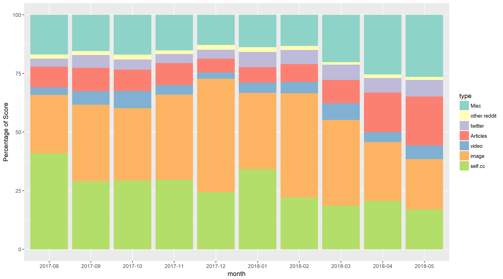

#### Articles/News

Top 20 article/news domains ordered by total score of posts:

```markdown
| domain                 | comments     | score  | posts| mean score  | mean comments  |
|------------------------|--------------|--------|------|-------------|----------------|
| medium.com             | 58474        | 212136 | 8694 | 24.4        | 6.7            |
| steemit.com            | 15882        | 57592  | 3076 | 18.7        | 5.2            |
| cnbc.com               | 9416         | 48660  | 673  | 72.3        | 14.0           |
| news.bitcoin.com       | 6293         | 43418  | 2015 | 21.5        | 3.1            |
| ccn.com                | 6423         | 42376  | 653  | 64.9        | 9.8            |
| coindesk.com           | 6844         | 24188  | 2411 | 10.0        | 2.8            |
| cointelegraph.com      | 4083         | 20821  | 2824 | 7.4         | 1.4            |
| cryptobible.io         | 3233         | 20518  | 150  | 136.8       | 21.6           |
| themerkle.com          | 5277         | 19269  | 2158 | 8.9         | 2.4            |
| forbes.com             | 3882         | 18505  | 571  | 32.4        | 6.8            |
| trustnodes.com         | 3018         | 13781  | 109  | 126.4       | 27.7           |
| m.news.naver.com       | 526          | 13712  | 6    | 2285.3      | 87.7           |
| usethebitcoin.com      | 1863         | 13655  | 359  | 38.0        | 5.2            |
| techcrunch.com         | 2105         | 13528  | 247  | 54.8        | 8.5            |
| bbc.com                | 730          | 12688  | 63   | 201.4       | 11.6           |
| bloomberg.com          | 3852         | 12664  | 537  | 23.6        | 7.2            |
| bitcoinist.com         | 3775         | 11703  | 384  | 30.5        | 9.8            |
| astralcrypto.com       | 478          | 10081  | 10   | 1008.1      | 47.8           |
| investinblockchain.com | 3398         | 10077  | 272  | 37.0        | 12.5           |
| thenextweb.com         | 2964         | 9691   | 139  | 69.7        | 21.3           |
```

Interesting that even within domains that are for long-form articles the top ones could still be considered "user-generated content". Anyone can create a medium or steemit account and start publishing there. For medium in particular, quite a few well known personalities publish there, I haven't checked what proportion of score is attributable to well known vs unknown medium accounts.

I'm slightly surprised to see cnbc posts doing better than more crypto-oriented sites like coindesk and cointelegraph.

The presence of m.news.naver.com in this list reflects the fact that high-scoring posts can accrue a very high score, in this case [one post about the re-opening of cryptocurrency trading in Korea](https://redd.it/7s9zmc) accounts for 13371 (lol) of that domain's score.

There are many other domains that only have a few posts associated with them, most are unremarkable but there are a few blogs of well known individuals associated with a small number of high-scoring posts each.

#### Project Blogs/subreddits

In the list of top domains there are several associated with specific cryptocurrencies, mostly their blogs or posts on their own subreddit. For example the Iota and Request Network blogs are within the top 25 domains ordered by score.

Rather than fixate on the domains, I plan to consider the presence of a set of cryptocurrency projects on /r/cryptocurrency more broadly. I'm interested in research questions like:

- How does a cryptocurrency become "popular on reddit"? 
- Are there observable differences in how cryptocurrency subreddit communities conduct themselves?

I have some ideas for how available data can shed light on these, but that feels like the start of a rabbit-hole and I'm not sure when I'll have time and enthusiasm to dive in. 

I'm interested to hear about other questions people are interested in addressing with this data.

I also intend to make access to the data-sets and R code used available, if anyone does anything interesting with this I'd love to hear about it. Also feel free to send PRs that improve on the shoddy-ness of my code, if witnessing this mess of for loops hanging together by a thread bothers you.

#### To close, some word-clouds

What better way to move on from this very general overview of /r/cryptocurrency than with some word-clouds showing the most common words from the titles of the top-scoring 10% of posts, by month.

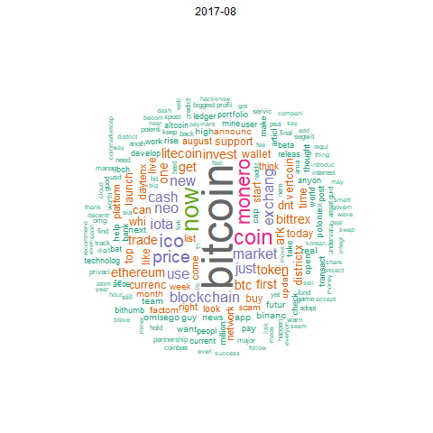

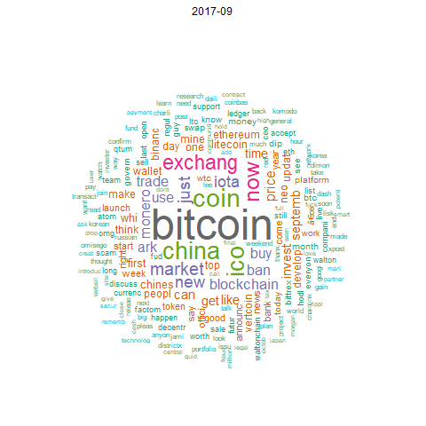

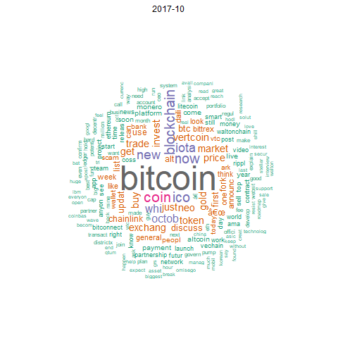

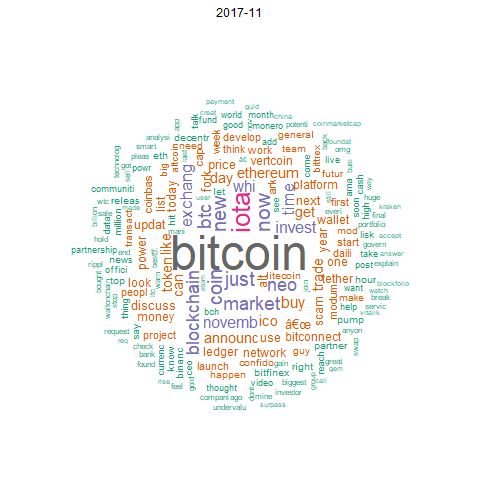

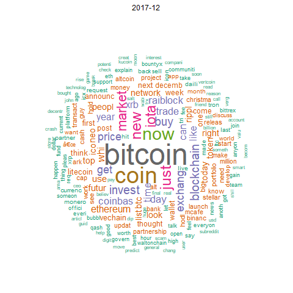

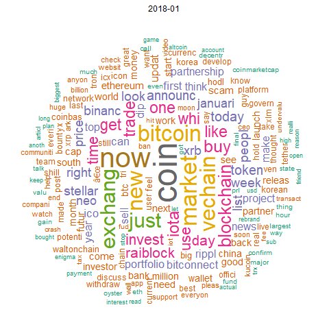

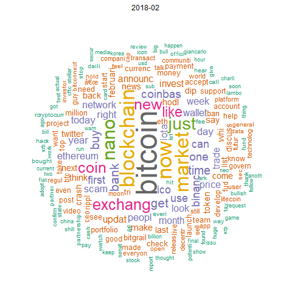

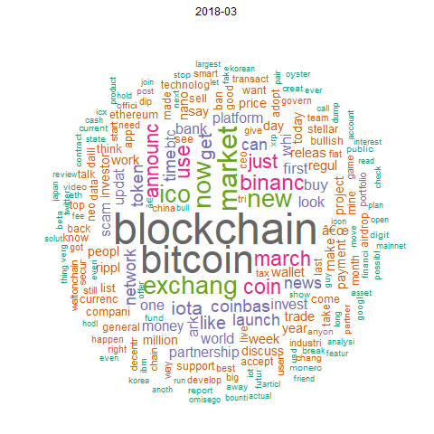

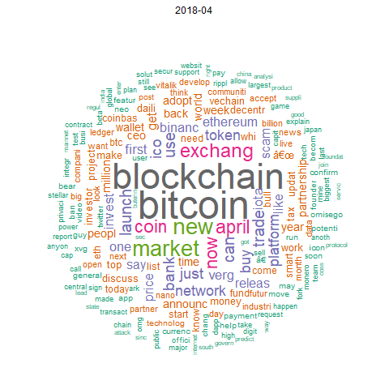

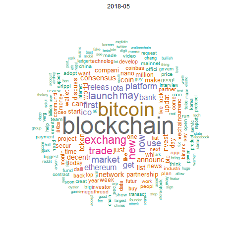
